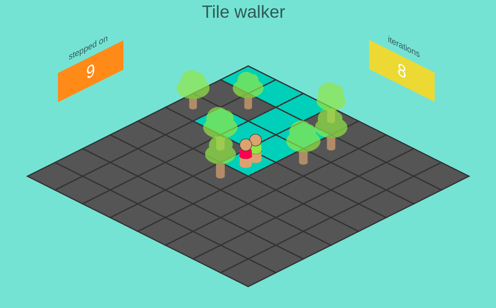
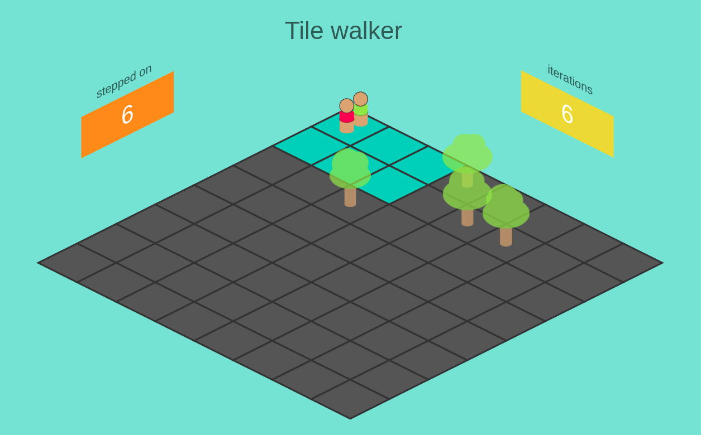
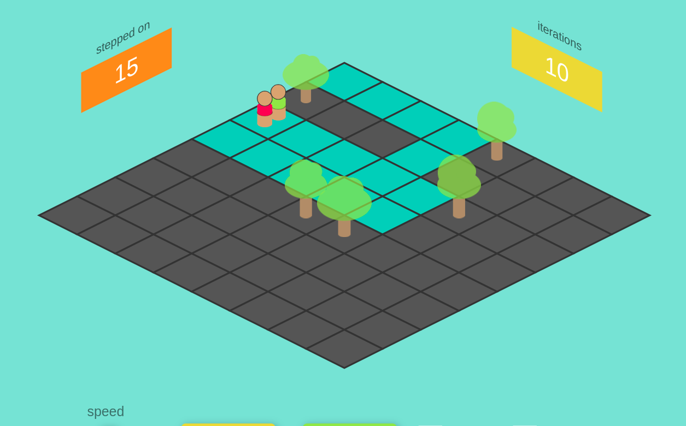
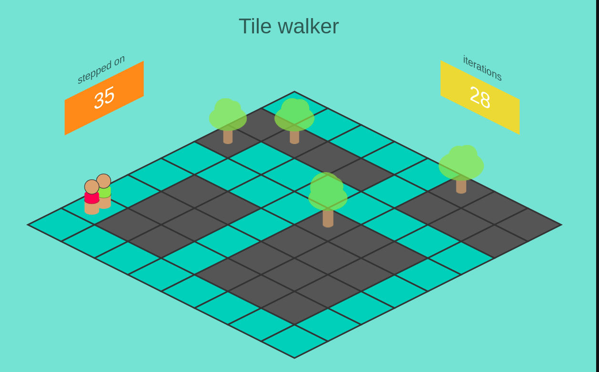
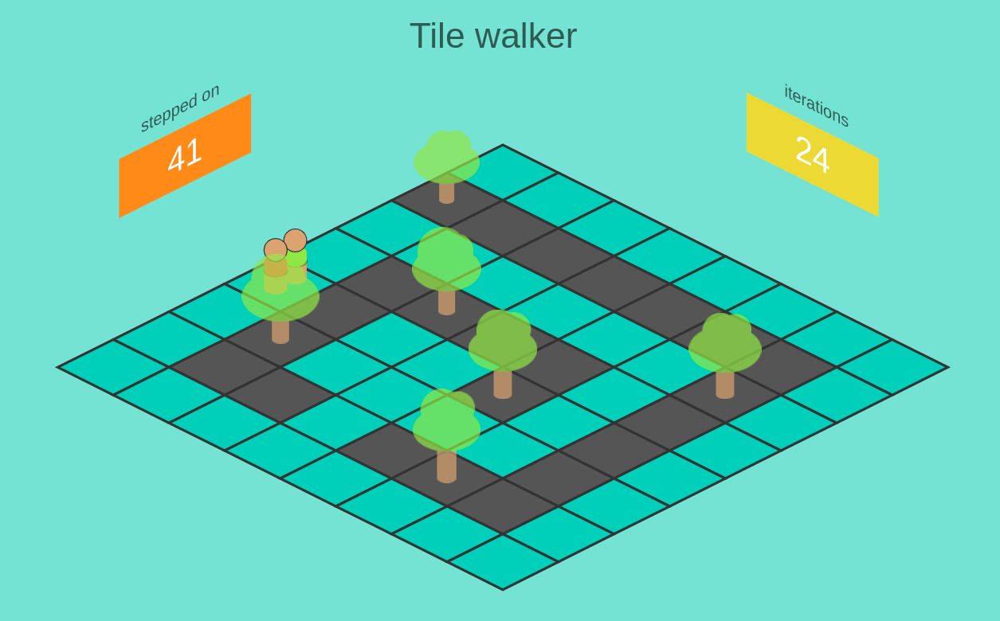

# tile-walker

Educational game that shows use of Floyd's cycle detection

[![LinkedIn][linkedin-shield]][linkedin-url]
[![Twitter][twitter-shield]][twitter-url]

<!-- PROJECT LOGO -->
<br />
<p align="center">
  <a href="https://tile-walker.web.app/">
    
  </a>

  <h3 align="center"><strong>tile-walker</strong> educational game</h3>

  <p align="center">
    Educational game that shows use of Floyd's cycle detection
    <br />
    <a href="https://tile-walker.web.app/"><strong>Play game</strong></a>
    ·
    <a href="https://github.com/borko-rajkovic/tile-walker/issues">Report Bug</a>
    ·
    <a href="https://github.com/borko-rajkovic/tile-walker/issues">Request Feature</a>
  </p>
</p>

<!-- TABLE OF CONTENTS -->

## Table of Contents

- [tile-walker](#tile-walker)
  - [Table of Contents](#table-of-contents)
  - [About The Project](#about-the-project)
  - [Play the game](#play-the-game)
  - [Game rules](#game-rules)
  - [How to know when the game is finished?](#how-to-know-when-the-game-is-finished)
  - [Floyd cycle detection](#floyd-cycle-detection)
  - [Examples](#examples)
    - [Example 1](#example-1)
    - [Example 2](#example-2)
    - [Example 3](#example-3)
    - [Example 4](#example-4)
    - [Example 5](#example-5)
  - [How to run for development](#how-to-run-for-development)
  - [Contributing](#contributing)
  - [Contact](#contact)

## About The Project

**tile-walker** is educational game that shows use of Floyd's cycle detection. It can be very helpful to have a visual representation of what is happening within the algorithm and this is attempt to make such a representation.

Feel free to make suggestions on how to improve this little game so it would benefit others.

## Play the game

Click [**https://tile-walker.web.app/**](https://tile-walker.web.app/) to play the game.

Alternatively, you can clone this repo and run it locally.

## Game rules

Tile walker is a simple game, it has only 2 rules:

- Player walks infinitely starting from top-left corner of the board, directed to right
- Whenever player hits the borders of the board or an obstacle (a tree), he moves 90 degrees and attempts to move again

The goal of the game is to cover largest area.

## How to know when the game is finished?

We don't want to allow game to run infinitely, but to stop it as soon as we calculate number of tiles that player stepped on.

Let's see how to achieve this.

If you look carefully, you will see that player must at some point repeat pattern of his walk (check [Examples](#examples)).

As we would like to stop the game at that point, we need to detect such pattern.

Let's represent position of a player with column and row on the board as follows:

```
Xpos = (col, row)
```

where col and row are the current column and row on the board that player occupies.

Other than position of the player, we have direction to the next tile as well.

```
Xdir = right
```

So in total, every step of the player is defined by his position and direction:

```
Xstep = Xpos, Xdir
```

Let's take steps from [Example 1](#example-1):

| Step # | Column | Row | Direction |
| ------ | ------ | --- | --------- |
| `1`    | `0`    | `0` | `right`   |
| 2      | 1      | 0   | right     |
| 3      | 2      | 0   | down      |
| 4      | 2      | 1   | left      |
| 5      | 1      | 1   | left      |
| 6      | 0      | 1   | up        |
| `7`    | `0`    | `0` | `right`   |
| 8      | 1      | 0   | right     |
| 9      | 2      | 0   | down      |
| 10     | 2      | 1   | left      |
| ...    | ...    | ... | ...       |

As can be seen from this table of events, step #7 is the same as step #1, hence we know this is a cycle that will repeat

In other words:

```
step #1 == step #7
step #2 == step #8
step #3 == step #9
...
```

This means our cycle is 6 steps long.

## Floyd cycle detection

One alghoritm that can be used to detect cycle in linked list is `Floyd cycle detection`

To put it in simple words, algorithm takes two pointers and run them along the list with one pointer taking one step per iteration, and second pointer taking 2 steps per iteration.

For a linked list that has closed loop, pointers will eventually colide. That is what we need to know to stop our game, since no more tiles will be stepped at from that point onward.

Hence, you see 2 players running at different speeds in our game.

>More on Floyd's cycle detection [here](https://en.wikipedia.org/wiki/Cycle_detection)


## Examples

Once you run application it will run with random configuration out of predefined scenarios.

These are meant to show how game could be played out.

Check out `demo.js` for placements of trees on a board.

### Example 1

Simple loop example



As red player is going double the speed, in a simple loop example it will take red player 2 circles around the loop and green player 1 circle to meet. It will be their first colision as well.

### Example 2

Meet before full circle



This example shows us that green and red player can meet even earlier than green player goes around loop once. In this example loop is yet to be obtained by the green player (by going to far right tree and down) when red player catches him and game stops. In this example it will be their only colision.

### Example 3

Almost colision example


As it can seem to a viewer, players colide on seventh iteration, on a cell (col index 3, row index 2), but it's not real colision, since we are making animation of how players move. In reality, red player does not stop at this cell at 7th iteration, but goes directly to cell (col index 3, row index 1).

### Example 4

Multiple colisions example



In this example we have multiple colisions. First one appears at 6th iteration. It is important to note that even if players do colide, it is not an ultimate requirement that loop has been detected. We need to consider their direction as well. In this example, they colide on same tile, but with different direction.

If we were to stop game at this point, we would miss out a huge chunk of tiles as can be seen on picture.

### Example 5

Real challenge example



This one just shows how it is possible to make huge area covered. Try to make different setting in order to make even larger area than what is shown in this example. Good luck and have fun!

## How to run for development

This game does not have any special requirements. It's enough to clone this repo by:

```
git clone git@github.com:borko-rajkovic/tile-walker.git
```

Then go to `tile-walker` directory and serve `index.html` with any light-weight web server of your choice.

## Contributing

Contributions are what make the open source community such an amazing place to learn, inspire, and create. Any contributions you make are **greatly appreciated**.

1. Fork the Project
2. Create your Feature Branch (`git checkout -b feature/AmazingFeature`)
3. Commit your Changes (`git commit -m 'Add some AmazingFeature`)
4. Push to the Branch (`git push origin feature/AmazingFeature`)
5. Open a Pull Request

<!-- CONTACT -->

## Contact

Borko Rajkovic

[![LinkedIn][linkedin-shield]][linkedin-url]
[![Twitter][twitter-shield]][twitter-url]

rajkovicborko@gmail.com

[linkedin-shield]: https://img.shields.io/badge/-LinkedIn-black.svg?style=flat-square&logo=linkedin&colorB=555
[linkedin-url]: https://linkedin.com/in/borko-rajkovic/
[twitter-shield]: https://img.shields.io/twitter/url?label=Twitter&style=social&url=https%3A%2F%2Ftwitter.com%2Fborko_88
[twitter-url]: https://twitter.com/borko_88
